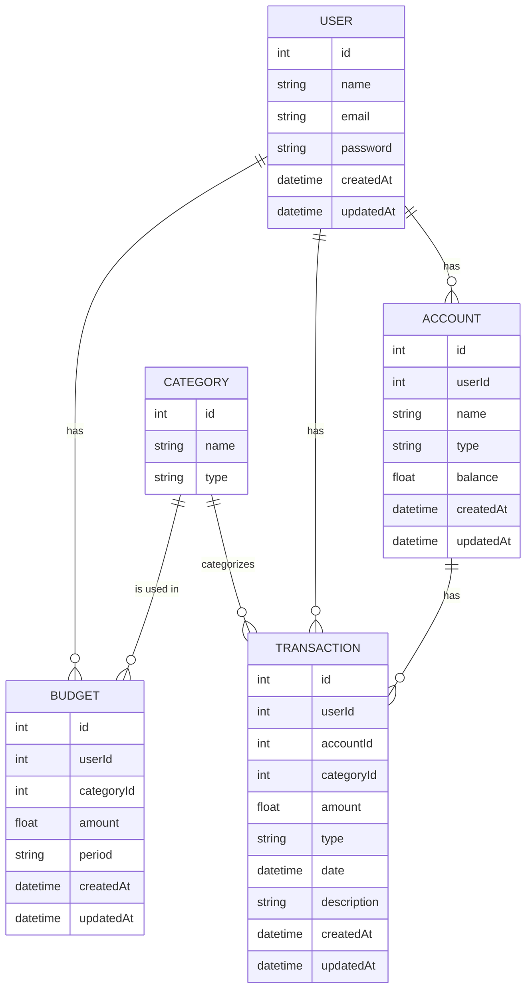

# guit-app-api

The backend for the POC Moneytracker app.

## Table of Contents

- [Installation](#installation)
- [Usage](#usage)
- [Database Schema](#database-schema) 
- [API Endpoints](#api-endpoints)
- [Environment Variables](#environment-variables)
- [Running Tests](#running-tests)
- [Project Structure](#project-structure)
- [License](#license)

## Installation

1. Clone the repository:
    ```sh
    git clone https://github.com/yourusername/guit-app-api.git
    cd guit-app-api
    ```

2. Install dependencies:
    ```sh
    pnpm install
    ```

3. Set up the database:
    ```sh
    pnpx prisma migrate dev
    ```

## Usage

1. Start the development server:
    ```sh
    pnpm run dev
    ```

2. Open your browser and navigate to `http://localhost:3000`.

## Database Schema


## API Endpoints

### Users
- `GET /user` - Retrieve all users
- `GET /user/:id` - Retrieve a user by ID
- `POST /user` - Create a new user
- `PUT /user/:id` - Update a user by ID
- `DELETE /user/:id` - Delete a user by ID

### Accounts
- `GET /user/:id/account` - Retrieve all accounts for a user
- `GET /user/:id/account/:accountId` - Retrieve an account by ID
- `POST /user/:id/account` - Create a new account
- `PUT /user/:id/account/:accountId` - Update an account by ID
- `DELETE /user/:id/account/:accountId` - Delete an account by ID

### Categories
- `GET /category` - Retrieve all categories
- `GET /category/:id` - Retrieve a category by ID
- `POST /category` - Create a new category
- `PUT /category/:id` - Update a category by ID
- `DELETE /category/:id` - Delete a category by ID

### Transactions
- `GET /user/:id/transactions` - Retrieve all transactions for a user
- `GET /user/:id/transactions/:transactionId` - Retrieve a transaction by ID
- `POST /user/:id/transactions` - Create a new transaction
- `PUT /user/:id/transactions/:transactionId` - Update a transaction by ID
- `DELETE /user/:id/transactions/:transactionId` - Delete a transaction by ID

### Budgets
- `GET /user/:id/budget` - Retrieve all budgets for a user
- `GET /user/:id/budget/:budgetId` - Retrieve a budget by ID
- `POST /user/:id/budget` - Create a new budget
- `PUT /user/:id/budget/:budgetId` - Update a budget by ID
- `DELETE /user/:id/budget/:budgetId` - Delete a budget by ID

## Environment Variables

Create a `.env` file in the root directory and add the following variables:
* DATABASE_URL="your-database-url"

## Running Tests

To run the tests, use the following command:

```sh
pnpm run test
```

## Project Struncture

.gitignore
guit-app/
    .env
    .gitignore
    [`guit-app/package.json`](guit-app/package.json )
    [`guit-app/pnpm-lock.yaml`](guit-app/pnpm-lock.yaml )
    prisma/
        migrations/
            ...
        [`guit-app/prisma/schema.prisma`](guit-app/prisma/schema.prisma )
    [`README.md`](README.md )
    src/
        [`guit-app/src/app.ts`](guit-app/src/app.ts )
        [`guit-app/src/index.ts`](guit-app/src/index.ts )
        libs/
            [`guit-app/src/libs/errorMessages.ts`](guit-app/src/libs/errorMessages.ts )
            [`guit-app/src/libs/prisma.ts`](guit-app/src/libs/prisma.ts )
        routes/
            [`guit-app/src/routes/account.routes.test.ts`](guit-app/src/routes/account.routes.test.ts )
            [`guit-app/src/routes/account.routes.ts`](guit-app/src/routes/account.routes.ts )
            [`guit-app/src/routes/budget.routes.test.ts`](guit-app/src/routes/budget.routes.test.ts )
            [`guit-app/src/routes/budget.routes.ts`](guit-app/src/routes/budget.routes.ts )
            [`guit-app/src/routes/categories.routes.test.ts`](guit-app/src/routes/categories.routes.test.ts )
            [`guit-app/src/routes/categories.routes.ts`](guit-app/src/routes/categories.routes.ts )
            [`guit-app/src/routes/transactions.routes.test.ts`](guit-app/src/routes/transactions.routes.test.ts )
            [`guit-app/src/routes/transactions.routes.ts`](guit-app/src/routes/transactions.routes.ts )
            ...
    [`guit-app/tsconfig.json`](guit-app/tsconfig.json )
LICENSE
[`README.md`](README.md )

# License

This project is licensed under the MIT License. See the LICENSE file for details.

Copyright (c) 2024 Pablo Rubaines